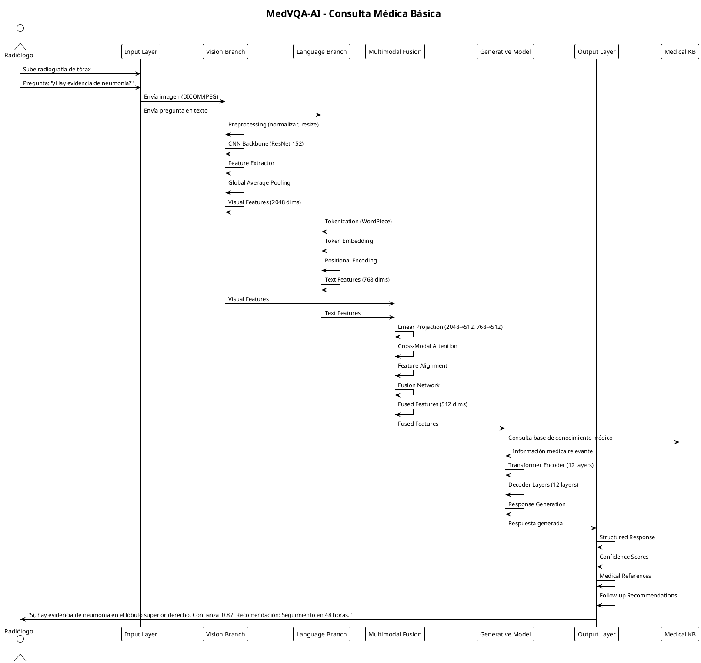
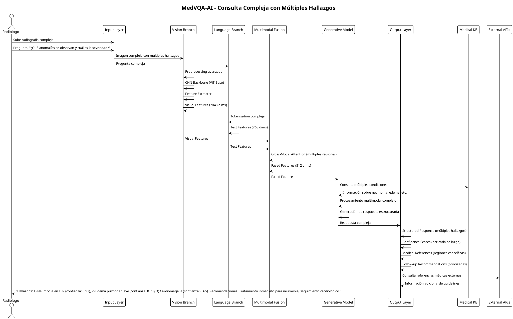
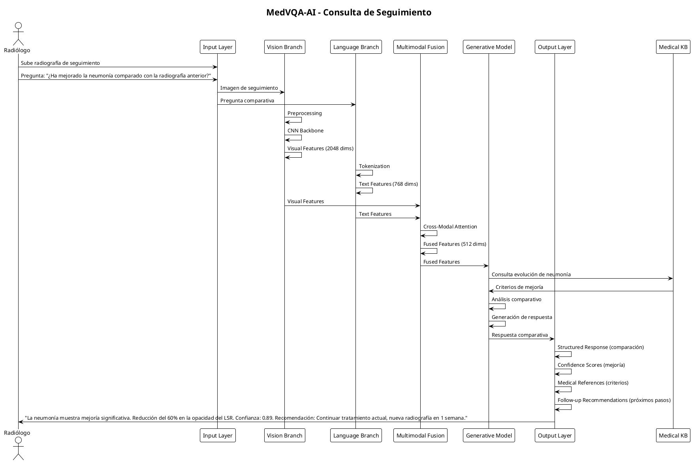
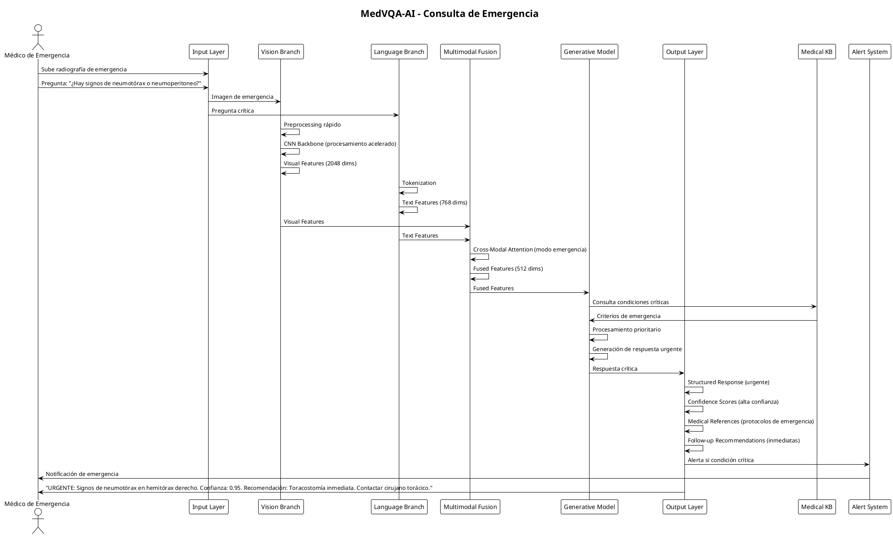

# 📋 MedVQA-AI - Explicación del Diagrama de Componentes y Casos de Uso

## 🏗️ **Explicación del Diagrama de Componentes UML**

### **Descripción General del Sistema MedVQA-AI**

El diagrama de componentes UML representa la arquitectura completa del sistema **MedVQA-AI**, un sistema de Visual Question Answering médico que combina procesamiento de imágenes médicas con generación de lenguaje natural para responder preguntas clínicas sobre radiografías de tórax.

### **Arquitectura por Capas**

#### **1. Input Layer (Capa de Entrada)**
- **Chest X-Ray Images**: Componente que maneja imágenes médicas en formato DICOM/JPEG
- **Natural Language Questions**: Componente que procesa preguntas médicas en lenguaje natural
- **Interfaces**: IImageInput e ITextInput para la comunicación entre capas

#### **2. Vision Branch (Rama de Visión)**
- **Image Preprocessing**: Normalización, redimensionamiento y aumento de imágenes
- **CNN Backbone**: Modelos pre-entrenados (ResNet-152, ViT-Base, DenseNet)
- **Feature Extractor**: Extracción de características visuales
- **Global Average Pooling**: Reducción dimensional
- **Visual Features**: Representación final de 2048 dimensiones

#### **3. Language Branch (Rama de Lenguaje)**
- **Tokenization**: Procesamiento de texto (WordPiece, BPE, SentencePiece)
- **Token Embedding**: Conversión a embeddings
- **Positional Encoding**: Codificación posicional
- **Text Features**: Representación final de 768 dimensiones

#### **4. Multimodal Fusion Layer (Capa de Fusión Multimodal)**
- **Linear Projection**: Proyección a espacio común (512 dims)
- **Cross-Modal Attention**: Mecanismo de atención cruzada
- **Feature Alignment**: Alineación de características
- **Fusion Network**: Red de fusión
- **Fused Features**: Representación fusionada de 512 dimensiones

#### **5. Generative Language Model (Modelo Generativo)**
- **Transformer Encoder**: Codificador con 12 capas y 8 cabezas
- **Decoder Layers**: Capas decodificadoras (12 capas, causal, enmascarado)
- **Medical Knowledge Base**: Base de conocimiento médico
- **Response Generator**: Generador de respuestas

#### **6. Output Layer (Capa de Salida)**
- **Structured Response**: Respuesta estructurada
- **Confidence Scores**: Puntuaciones de confianza
- **Medical References**: Referencias médicas
- **Follow-up Recommendations**: Recomendaciones de seguimiento

#### **7. Componentes Externos**
- **Medical-CXR-VQA Dataset**: Dataset con 780,014 pares pregunta-respuesta
- **External Medical APIs**: APIs médicas externas

---

## 🔄 **Diagramas de Secuencia para Casos de Uso**

### **Caso de Uso 1: Consulta Médica Básica**

### **Caso de Uso 2: Consulta Compleja con Múltiples Hallazgos**

### **Caso de Uso 3: Consulta de Seguimiento**

### **Caso de Uso 4: Consulta de Emergencia**

---

## 🔍 **Análisis de Flujos de Datos**

### **Flujo Principal de Datos**
1. **Entrada**: Imagen + Pregunta → Input Layer
2. **Procesamiento Paralelo**: Vision Branch + Language Branch
3. **Fusión**: Multimodal Fusion Layer
4. **Generación**: Generative Language Model
5. **Salida**: Output Layer → Respuesta estructurada

### **Puntos de Integración**
- **Cross-Modal Attention**: Punto crítico donde se combinan características visuales y textuales
- **Medical Knowledge Base**: Integración de conocimiento médico especializado
- **External APIs**: Conexión con sistemas médicos externos

### **Consideraciones de Rendimiento**
- **Procesamiento Paralelo**: Vision y Language Branch operan simultáneamente
- **Optimización**: Diferentes modelos CNN según complejidad de la consulta
- **Modo Emergencia**: Procesamiento acelerado para casos críticos

---

## 🛡️ **Puntos de Vulnerabilidad Identificados**

### **En el Flujo de Datos**
1. **Input Layer**: Manipulación de imágenes o preguntas
2. **Vision Branch**: Adversarial examples en CNN
3. **Language Branch**: Prompt injection en tokenization
4. **Multimodal Fusion**: Cross-modal attacks
5. **Generative Model**: Manipulación de respuestas
6. **Output Layer**: Interceptación de resultados

### **En las Interfaces**
- **IImageInput**: Validación de imágenes médicas
- **ITextInput**: Sanitización de preguntas
- **IExternalAPIs**: Autenticación y autorización
- **IDataset**: Integridad del dataset médico

---

**¡Estos diagramas proporcionan una visión completa del sistema MedVQA-AI!** 🎯🏥
